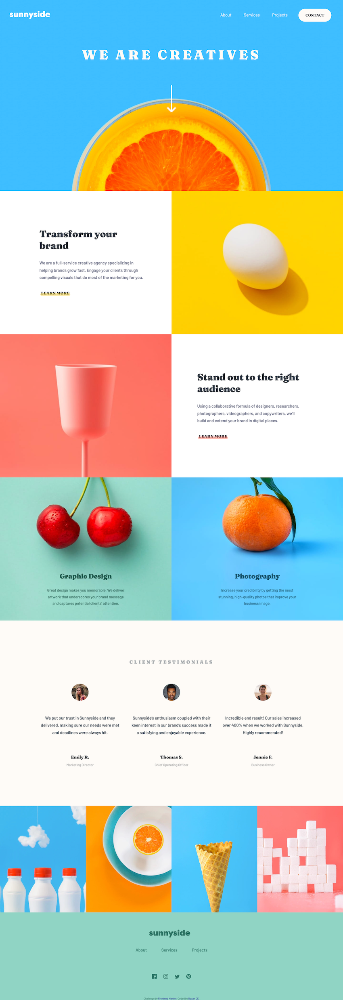
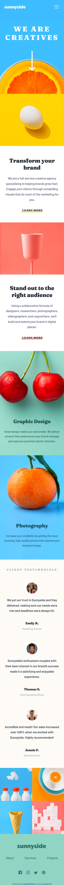

# Frontend Mentor - Sunnyside agency landing page solution

This is a solution to the [Sunnyside agency landing page challenge on Frontend Mentor](https://www.frontendmentor.io/challenges/sunnyside-agency-landing-page-7yVs3B6ef). Frontend Mentor challenges help you improve your coding skills by building realistic projects.

## Table of contents

- [Overview](#overview)
  - [The challenge](#the-challenge)
  - [Screenshot](#screenshot)
  - [Links](#links)
  - [My process](#my-process)
  - [Built with](#built-with)
  - [What I learned](#what-i-learned)
  - [Continued development](#continued-development)
  - [Author](#author)

## Overview

### The challenge

Users should be able to:

- View the optimal layout for the site depending on their device's screen size
- See hover states for all interactive elements on the page

### Screenshot

### Links

- Solution URL: [Add solution URL here](TBA)
- Live Site URL: [Add live site URL here](TBA)

## My process

- I first worked on the HTML to section and add tags on the content. Just plain text was included in the package, so I had to manually add the logos, images, links, etc.

- From there, I started to work on the CSS, and as I continued, I added classes to the HTML tags to be able to use those classes as selectors.

- Initially, I just wanted to get the general layout of the page, focusing on the structure and making sure everything is where they needed to be.

- When I was happy with the structure, I started to work on getting more accurate sizing, paddings and margin to get the page as close to the design as possible.

- After getting it as close to the design image as I could, I started to work on the hover states.

- Finally, after I was happy with everything on the desktop site, I worked on the responsiveness of the page. I added the media queries to make sure that the page looks great in every breakpoint.

- Similar to how I worked on the desktop size, for mobile, I worked on the general structure of the page first, getting the padding, margin, sizes, and then the hover states only found on the mobile page such as the drop down menu.

### Built with

- Semantic HTML5 markup
- CSS
- Flexbox

### What I learned

This project was a great practice for HTML and CSS.
  - I gained a better understanding of the flex-box model.
  - Learned a few small tricks using the underline and the dropdown menu.

### Continued development / Improvements

- Next time, I would like to write mobile-first CSS. For this project, I started working on the desktop site first.
It was only once I got to the media queries and breakpoints that I realized my mistake.

- I also need to work on a cleaner, more concise CSS. I tried to get the page as close to the design image as possible,  but in doing so, I ended up with too many different font sizes, paddings and margins.

## Author

- Website - Roxan(TBA)
- Frontend Mentor - Roxan CE (https://www.frontendmentor.io/profile/yourusername)
- Twitter - Roxan-CE (https://github.com/Roxan-CE)
